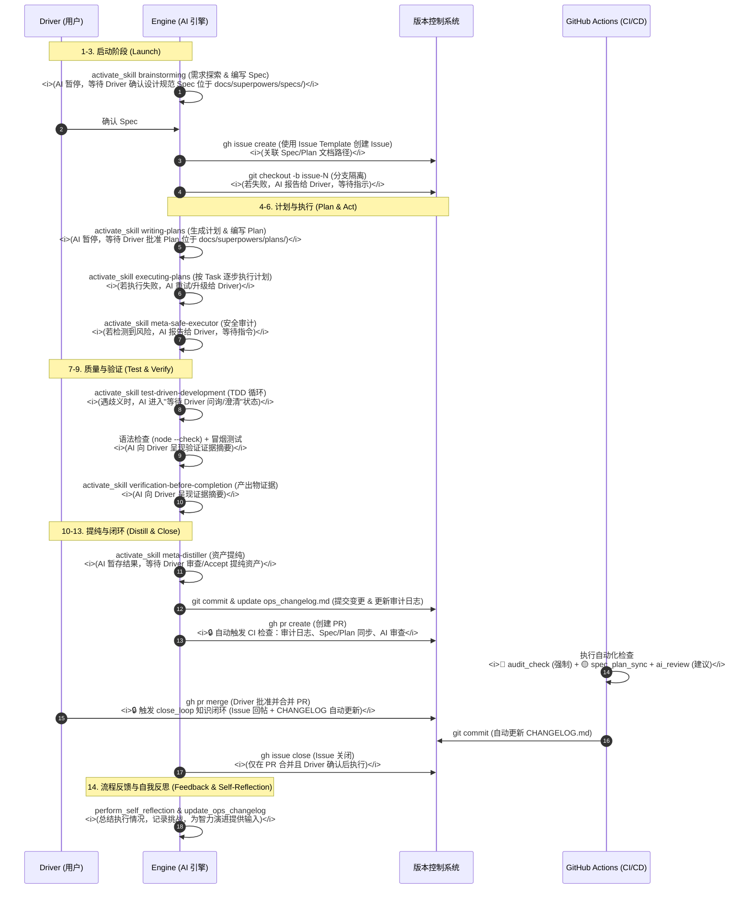

## 开发、生产生命周期

描述一个任务从需求探索到代码合并的全流程物理轨迹，深度融合 Superpowers 以确保工程质量，并明确人机交互与错误处理。



---

## 🏗️ SOLID 设计原则实践

本项目在架构演进过程中，严格遵循 SOLID 原则以确保系统的可扩展性与可维护性：

### 核心原则 (Core Principles)

#### 1. 单一职责原则 (SRP - Single Responsibility Principle)

> **核心原则**：一个类或模块应该只有一个引起它变化的原因。

- **识别信号**：如果一个类承担了多个职责，代码会表现出" shotgun surgery "（一处修改，多处改动）。
- **实践方法**：按职责分离，每个模块只专注一件事。
- **示例**：数据处理模块不应同时负责 UI 渲染；存储服务不应同时负责业务逻辑。

#### 2. 开闭原则 (OCP - Open/Closed Principle)

> **核心原则**：软件实体应该对扩展开放，对修改关闭。

- **识别信号**：每次新增功能都需要修改现有代码，增加回归风险。
- **实践方法**：使用策略模式、模板方法模式、依赖注入，通过扩展而非修改来增加新功能。
- **示例**：验证器通过接口定义，新增验证规则时只需实现新类，无需修改现有验证器。

#### 3. 里氏替换原则 (LSP - Liskov Substitution Principle)

> **核心原则**：子类应该能够替换父类，而不破坏程序的正确性。

- **识别信号**：子类重写父类方法后抛出异常或返回意外结果。
- **实践方法**：子类不应强化前置条件、不应弱化后置条件、不应违反父类不变量。
- **示例**：`Square` 不应继承 `Rectangle`，因为长宽相等的约束会破坏替换性。

#### 4. 接口隔离原则 (ISP - Interface Segregation Principle)

> **核心原则**：客户端不应被迫依赖它不使用的方法。

- **识别信号**：接口臃肿，实现类中存在大量 `throw new UnsupportedOperationException()`。
- **实践方法**：将大接口拆分为多个小接口，客户端只依赖需要的方法。
- **示例**：将 `Worker` 接口拆分为 `Workable`、`Feedable`、`Sleepable`，机器人只需实现 `Workable`。

#### 5. 依赖倒置原则 (DIP - Dependency Inversion Principle)

> **核心原则**：高层模块不应依赖低层模块，两者都应依赖抽象；抽象不应依赖细节，细节应依赖抽象。

- **识别信号**：业务逻辑直接依赖具体实现（如数据库、HTTP 客户端），难以测试和替换。
- **实践方法**：面向接口编程，使用依赖注入容器，将具体实现作为外部配置。
- **示例**：服务层依赖 `Repository` 接口，而非直接依赖 `MySQLRepository` 类。

#### 6. 最少知识原则 (LoD - Law of Demeter)

> **核心原则**：一个对象应该对其他对象有最少的了解；只与直接朋友通信。

- **识别信号**：代码中出现链式调用 `a.getB().getC().doSomething()`。
- **实践方法**：通过委托方法隐藏内部结构，减少耦合。
- **示例**：

  ```typescript
  // ❌ 违反 LoD
  const city = user.getDepartment().getManager().getAddress().getCity()

  // ✅ 遵循 LoD
  const city = user.getManagerCity()
  ```

---

# 人机交互规范 (Human-in-the-Loop Standards)

### 1. AI 暂停点 (AI Pause Points)

在以下关键节点，AI 必须暂停并等待 Driver 确认：

| 阶段     | 暂停点              | 等待内容                                                |
| -------- | ------------------- | ------------------------------------------------------- |
| **启动** | `brainstorming` 后  | Driver 确认初步方案                                     |
| **设计** | `brainstorming` 后  | Driver 确认设计规范 Spec (位于 docs/superpowers/specs/) |
| **计划** | `writing-plans` 后  | Driver 批准 Plan (位于 docs/superpowers/plans/)         |
| **执行** | 遇到风险操作        | Driver 指令（如破坏性变更）                             |
| **验证** | 测试失败/歧义       | Driver 澄清或调整预期                                   |
| **提纯** | `meta-distiller` 后 | Driver 审查资产                                         |
| **闭环** | 合并请求创建后      | Driver 合并确认                                         |

### 2. AI 升级条件 (Escalation Conditions)

当遇到以下情况时，AI 应将问题升级给 Driver：

- **执行失败**：`executing-plans` 连续失败 3 次以上。
- **风险检测**：`meta-safe-executor` 检测到高风险操作（如数据迁移、核心逻辑重构）。
- **歧义阻塞**：TDD 测试中发现需求歧义，无法继续。
- **资源不足**：需要外部 API 密钥、设计资源或跨团队协调。

### 3. 证据呈现规范 (Evidence Presentation)

AI 在 `verification-before-completion` 阶段必须呈现以下证据：

```markdown
### 验证证据

- [ ] 单元测试通过率：X/Y
- [ ] 手动测试截图/录屏：[附件]
- [ ] 性能对比：优化前后数据
- [ ] 兼容性测试：相关平台/环境
```

### 4. Issue 创建最佳实践

**⚠️ Windows 环境注意**：使用 `gh issue create` 时，**必须使用 `--body-file` 参数**，避免 `--body "文本"` 导致 Markdown 内容丢失。

```bash
# ✅ 正确方式：使用临时文件
echo "## 📋 需求描述..." > temp_body.md
gh issue create --title "标题" --body-file temp_body.md --label "enhancement"
del temp_body.md

# ❌ 错误方式：Windows 下 Markdown 内容会丢失
gh issue create --title "标题" --body "## 内容..."
```

---
